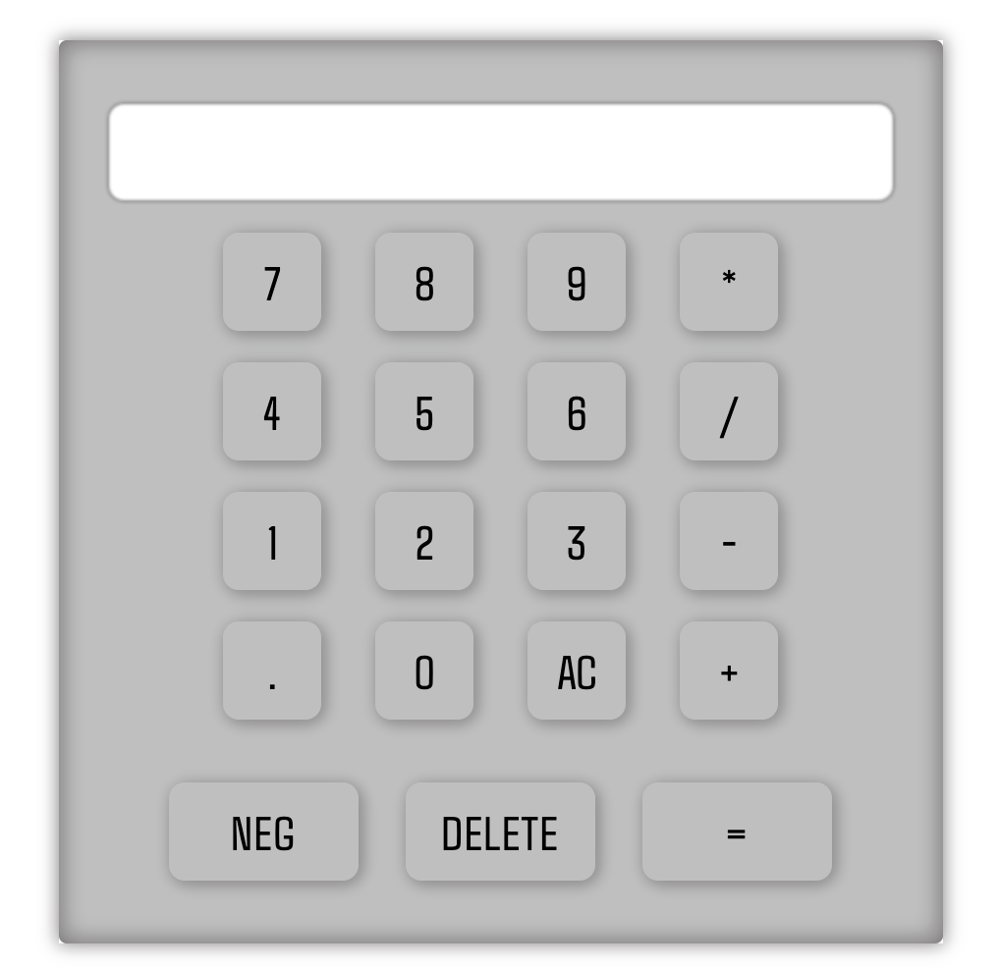

# Calculator

## About
A calculator that performs fundamental arithmetic operations, namely addition, subtraction, multiplication, and division

## features
1. Access on mobile or desktop devices (touch)
2. Proper order of operations 
3. Instructions included

## Languages:
1. JavaScript
2. CSS
3. HTML